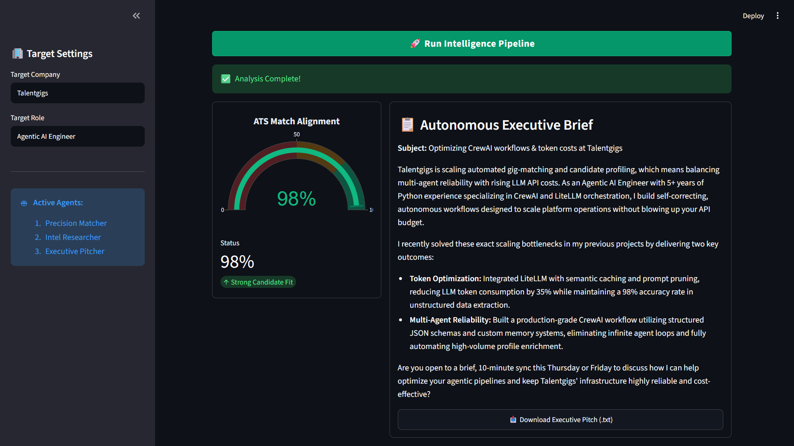
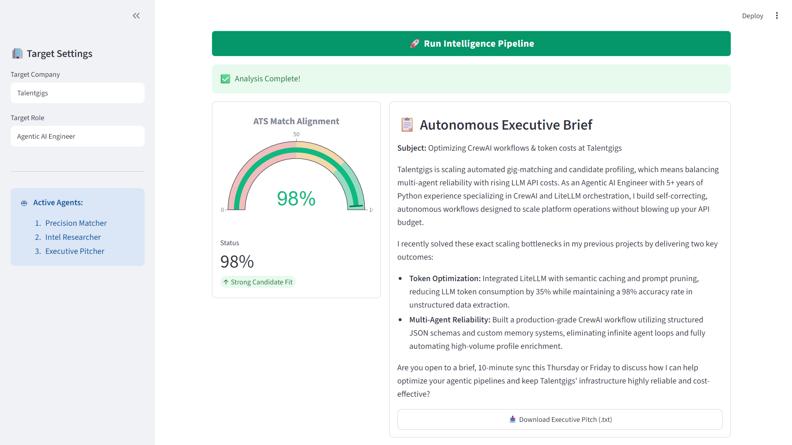

# ⚡ Auto-Apply Intelligence Suite

An autonomous multi-agent recruitment and executive outreach engine built with **CrewAI**, **Google Gemini 2.0**, and **LiteLLM**. The suite performs deep semantic alignment between candidate capabilities and enterprise role requirements, diagnoses technical pain points, and synthesizes recruiter-ready executive briefs with zero boilerplate.

---

## 🚀 Key Highlights

* **Multi-Agent Orchestration:** 3 specialized agents executing sequential analysis:
  * **Precision Matcher:** Audits technical depth, calculates alignment percentages, and isolates skill gaps.
  * **Intel Researcher:** Decodes company architectural bottlenecks (e.g., token consumption, agent drift, latency).
  * **Executive Pitcher:** Drafts hyper-personalized outreach briefs tailored to engineering leaders.
* **Interactive Telemetry UI:** Single-view Streamlit interface styled with crisp emerald green accents (`#10b981`).
* **Visual Match Alignment:** Plotly-powered speedometer gauge providing real-time visual telemetry (0–100%).
* **One-Click Export:** Integrated `.txt` pitch exporter for instant talent acquisition outreach.
* **Deterministic Execution:** Stabilized with Gemini 2.0 Flash reasoning architecture and structured outputs.

---

## 🏗️ Architecture Flow

```text
[ Candidate Resume ] + [ Job Description ]
                 │
                 ▼
     ┌────────────────────────┐
     │ 1. Precision Matcher   │ ➔ ATS Score & Tech Competency Audit
     └───────────┬────────────┘
                 ▼
     ┌────────────────────────┐
     │ 2. Intel Researcher    │ ➔ Architectural Bottlenecks & Margin Analysis
     └───────────┬────────────┘
                 ▼
     ┌────────────────────────┐
     │ 3. Executive Pitcher   │ ➔ Cold Pitch & High-Impact Solution Proposal
     └───────────┬────────────┘
                 ▼
 [ Streamlit Speedometer (0-100%) + Executive Brief + TXT Exporter ]

 🛠️ Tech Stack
​Core Framework: CrewAI
​LLM Engine: Google Gemini 2.0 Flash via LiteLLM
​Frontend UI: Streamlit
​Data Visualization: Plotly Graph Objects
​Environment: Python 3.11+ / 3.13

​⚡ Getting Started

​1. Clone the Repository
```bash

git clone https://github.com/satyanarayana51115/auto-apply-intelligence-suite.git
cd auto-apply-intelligence-suite
```

2. Configure Virtual Environment

python -m venv .venv
### On Windows:
.venv\Scripts\activate
### On macOS/Linux:
source .venv/bin/activate
```
3. Install Dependencies
```
pip install -r requirements.txt
```
4. Setup Environment Variables
​Create a .env file in the root folder:
```
GEMINI_API_KEY=your_gemini_api_key_here
```
5. Launch Application
```
streamlit run app.py
```
📸 Output Preview

​* **ATS Alignment Telemetry:** Dynamic Plotly gauge visualizing candidate fit percentage.
​* **Executive Pitch:** Actionable technical value proposition ready for direct outreach on LinkedIn or     InMail.

```

## 📸 Output Preview

### 🌙 Dark Mode Interface


---

### ☀️ Light Mode Telemetry



